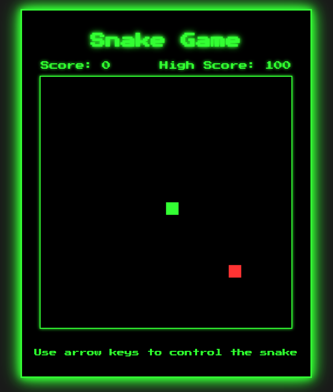

# Snake game

_A veces cuando me aburro, comienzo a programar cositas asi_

## To-do:

- [x] Re-estructura en clases y modulos.
- [x] Sistema de puntuación
- [x] Persistencia de puntuación alta (localStorage)
- [x] Diseño responsivo
- [x] Rediseño visual retro
- [x] Niveles de dificultad
- [x] Pantalla de inicio y fin de juego
- [ ] Obstáculos

## Build with 🛠️

- HTML
- CSS
- JS



## Structure

```
    snake-game/
    │
    ├── src/
    │ ├── modules/
    │ │ ├── game.js
    │ │ ├── snake.js
    │ │ ├── food.js
    │ │ ├── renderer.js
    │ │ └── scoreManager.js
    │ │
    │ ├── utils/
    │ │ └── utils.js
    │ │
    │ ├── styles/
    │ │ └── style.css
    │ │
    │ └── index.js
    │
    ├── public/
    │ └── index.html
    │
    ├── assets/
    │ └── ...
    │
    ├── tests/
    │ └── ...
    │
    ├── docs/
    │ └── ...
    │
    ├── .gitignore
    ├── package.json
    ├── README.md
    └── eslint.config.js
```

## License

MIT

⌨️ with ❤️ by [@camjasaez](https://github.com/camjasaez)
